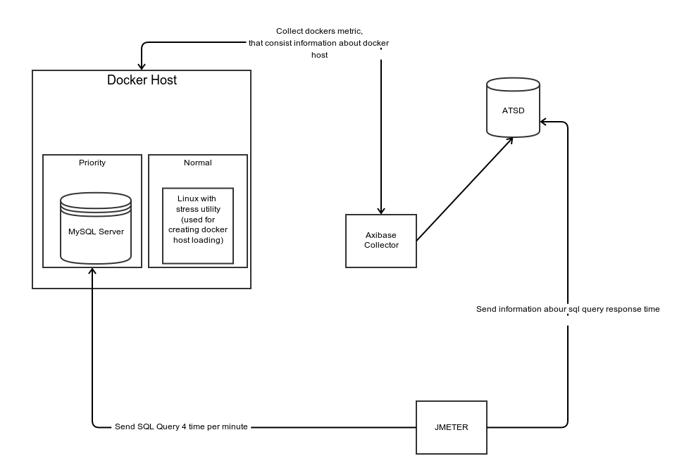
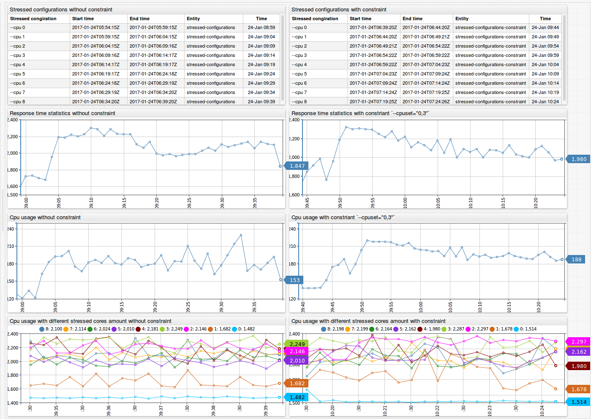

# Docker constraint research project

## Description 

### Docker host

  We have a docker host machine with two containers:
  
  1. Priority - [MySQL database server](https://hub.docker.com/_/mysql/)
     We test loading of MySQL database. We imported the [following dataset](https://dev.mysql.com/doc/employee/en/). The main metric that is response time the following SQL query:
     ```sql
      SELECT
        AVG(salary) AS 'avg_salary'
      FROM titles t1
        JOIN salaries t2 ON t1.emp_no = t2.emp_no
      WHERE LOCATE('Engineer', title) > 0
     ```
     
  2. [Normal](https://hub.docker.com/r/dkuffner/docker-stress/) - Linux with [stress utility](https://linux.die.net/man/1/stress) that can impose load on and stress test systems

### Testing tool

   [Apache JMeter](http://jmeter.apache.org/). Jmeter uses to send SQL query to our priority container and collect 
    information about query response time and then send it to our ATSD instance.
    
### Information about docker host
  
  [Axibase collecor](https://github.com/axibase/axibase-collector-docs#axibase-collector) help us to collect information about docker host(such as cpu usage by container, host properties and others) by [remote connection](https://github.com/axibase/axibase-collector-docs/blob/master/jobs/docker.md#remote-collection).
    
### Statistic storage
  Information about response time and docker host stored in instance of [Axibase Time Series Database](https://github.com/axibase/atsd-docs/blob/master/tutorials/getting-started.md)
    
All components are displayed on the following diagram:



### Method of research

For researching constraint we will reproduce the following steps:

  1. Enable loading of MySQL server by Apache Jmeter
  2. Create set of stressed configuration
     We will run stressed container with different configuration and observe how it affects on mysql response time.
  3. Then we repeat second step but all stressed configuration  will run with tested constraint.
  4. Compare values of response time and characteristic that controlled by constraint.

## Cpu constraints

For each cpu constraints we will load CPU's cores by `--cpu` stress option. And then we try to decrease priority container response time by constraints.

### Without constraint conditions

#### Response time

##### Overall table without constraint mode

| Statistic type | --cpu 0  | --cpu 1  | --cpu 2  | --cpu 3  | --cpu 4 | --cpu 5  | --cpu 6  | --cpu 7  | --cpu 8 | 
|----------------|----------|----------|----------|----------|---------|----------|----------|----------|---------| 
| min            | 1403     | 1461     | 1769     | 1887     | 1517    | 1496     | 1478     | 1486     | 1500    | 
| max            | 1520     | 2408     | 2710     | 2818     | 2779    | 2594     | 2610     | 2760     | 2776    | 
| avg            | 1465.38  | 1821.73  | 2264.13  | 2353.33  | 2209.5  | 1934.06  | 2122.25  | 2063.31  | 2083.81 | 
| pct90          | 1520     | 2391.8   | 2709.4   | 2818     | 2779    | 2593.3   | 2600.9   | 2748.1   | 2776    | 
| pct95          | 1520     | 2408     | 2710     | 2818     | 2779    | 2594     | 2610     | 2760     | 2776    | 
| pct99          | 1520     | 2408     | 2710     | 2818     | 2779    | 2594     | 2610     | 2760     | 2776    | 


#### Cpu usage by containers

| Process | --cpu 0 | --cpu 1 | --cpu 2 | --cpu 3 | --cpu 4 | --cpu 5 | --cpu 6 | --cpu 7 | --cpu 8 |
|---------|---------|---------|---------|---------|---------|---------|---------|---------|---------|
| host    | 0.05    | 99.91   | 445.37  | 200.26  | 445     | 441.55  | 197.93  | 442.8   | 200     |
| mysql   | 139.98  | 173.35  | 214.11  | 213.88  | 204.21  | 199.03  | 193.46  | 192.05  | 194.78  |


##### Overall table in constraint mode

| Statistic type | --cpu 0 | --cpu 1   | --cpu 2   | --cpu 3   | --cpu 4   | --cpu 5 | --cpu 6   | --cpu 7   | --cpu 8  |
|----------------|---------|-----------|-----------|-----------|-----------|---------|-----------|-----------|----------|
| min            | 1481    | 1486      | 1664      | 1540      | 2001      | 1730    | 1519      | 1572      | 1541     |
| max            | 2506    | 1527      | 2751      | 2792      | 2394      | 2881    | 2227      | 2957      | 2839     |
| avg            | 1855.5  | 1510.1875 | 2055.2856 | 2069.7144 | 2220.5715 | 2202.4  | 2011.3572 | 2184.9333 | 2072.077 |
| pct90          | 2339.4  | 1525.6    | 2657      | 2791      | 2359.5    | 2874.4  | 2224      | 2831      | 2809.8   |
| pct95          | 2506    | 1527      | 2751      | 2792      | 2394      | 2881    | 2227      | 2957      | 2839     |
| pct99          | 2506    | 1527      | 2751      | 2792      | 2394      | 2881    | 2227      | 2957      | 2839     |


### Cpu usage by containers

| Process | --cpu 0 | --cpu 1 | --cpu 2 | --cpu 3 | --cpu 4 | --cpu 5 | --cpu 6 | --cpu 7 | --cpu 8 |
|---------|---------|---------|---------|---------|---------|---------|---------|---------|---------|
| host    | 0.05    | 99.91   | 445.37  | 200.26  | 445     | 441.55  | 197.93  | 442.8   | 200     |
| mysql   | 139.98  | 173.35  | 214.11  | 213.88  | 204.21  | 199.03  | 193.46  | 192.05  | 194.78  |


More detail comparision can view in following chartlab portal





